# Ladderbot4 Documentation

Welcome to the **Ladderbot4 Documentation**! This guide is designed to help users and administrators set up and fully utilize Ladderbot4 for managing competitive ladders and tournaments within a Discord server. Whether you're configuring the bot for the first time or using its extensive features, this documentation will provide clear instructions and examples to guide you every step of the way.

## Features
Ladderbot4 offers powerful tools for managing competitive ladders, including:
- Dynamic team management and ranking systems.
- Automated challenge and match result reporting.
- Comprehensive statistics tracking for teams and individual members.
- Achievements, historical match data, and much more!

## Getting Started
This documentation will guide you through the following essential setup steps:
1. **Configuring the Bot**:
   - Setting up the bot's Discord token.
   - Configuring the GitHub Personal Access Token (PAT).
   - Providing the Git HTTPS URL path for backups.
   - Setting the Guild ID to enable slash commands.

2. **Using Commands**:
   - Overview of user commands for interacting with ladders and teams.
   - Explanation of admin commands for advanced configuration and management.
   - Detailed mechanics for each command, including examples and expected outputs.

---

With this guide, you'll be ready to set up Ladderbot4 in your Discord server and make full use of its capabilities. Let's get started!

---

## Configuring The Bot
How to get/set the Discord Token, Git PAT Token, Git Repo HTTPS Url Path, and the Guild ID for SlashCommands:

## How to Setup Discord Developer Portal Correctly (Discord Token and Bot Invite)

Naivgate to the [Discord Developer Portal](https://discord.com/developers) and log in to your Discord account to follow these steps to correctly set up the bot invite link and generate the Discord Token you will need:

---

### Step 1: Create New Application
After logging into the Discord Developer Portal, while in the **Applications** tab click the `New Application` button and enter the name you desire for the new bot.

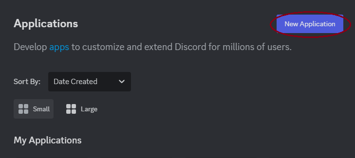

---

### Step 2: Enable Intents
After entering a name you will be transfered into the General Information tab of the new application. On the left side of the screen click **Bot** (Click three lines if sidebar is not shown automatically).

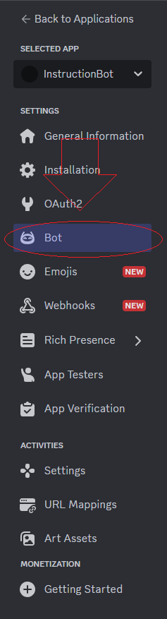

1. Enable each **Privileged Gateway Intent** for the Bot
2. Be sure to **Save the Changes**.

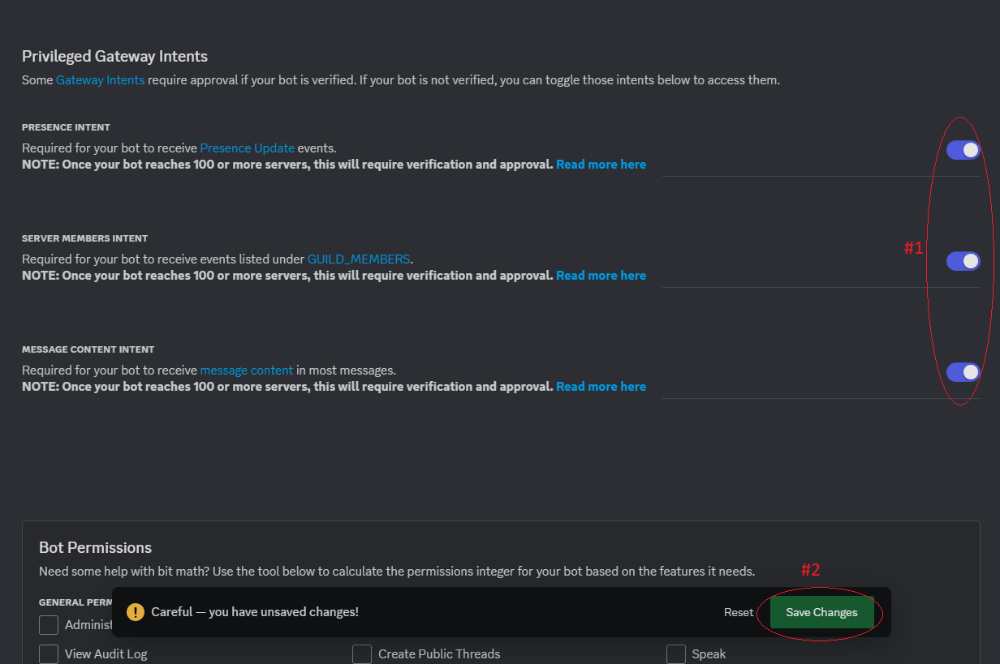

**HINT** In this Bot tab above the Intents is also where you can change the icon for your bot. This will also change in Discord itself and looks way better than Discord's default avatar.
---

### Step 3: OAuth2 URL Generator
After being sure to save the changes to Intents, now on the left sidebar click the **OAuth2** tab.

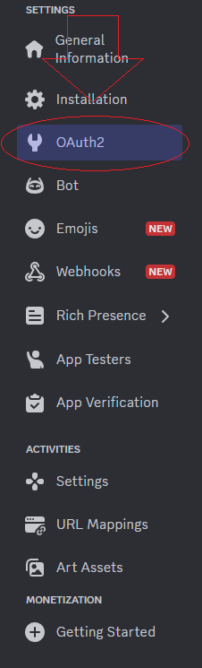

Now under **Scopes** tick the box for `bot` and `applications.commands`. After you tick `bot` another box containing more choices will appear below called **Bot Permissions**. Only choose `Administator` from this box, after ticking it every other choice is greyed out anyway.
Your result should look similar to this so far:

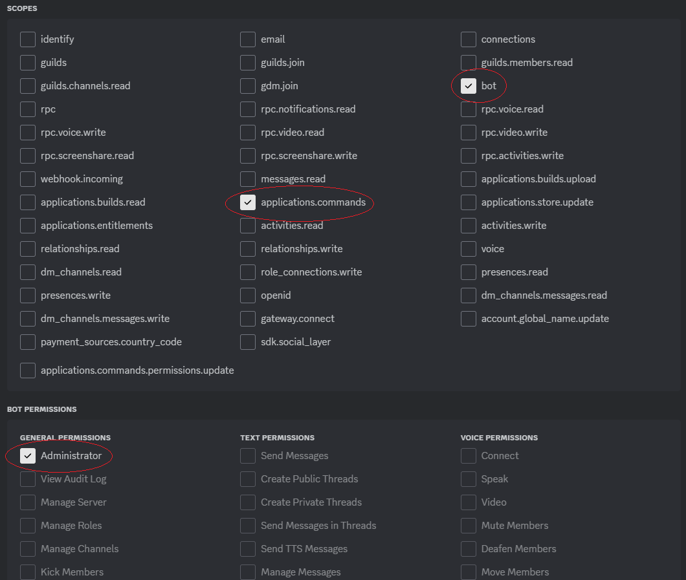

Now scroll down and you'll see a dropdown box. Make sure **Guild Install** is selected and the **Generated URL** is now what you can copy and use to invite this bot to your personal Discord server!

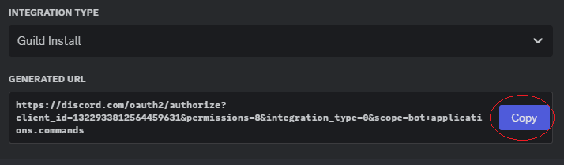

---

### Step 4: Invite Bot To Server

Go to the link and it should cause a popup in your Discord. Make sure to have the correct server selected in the drop down to invite the bot to and hit **Continue**.

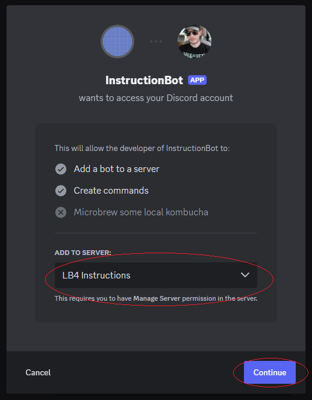

Another popup will show the Bot is being invited with Adminitrator Rights, hit **Authorize** to continue.

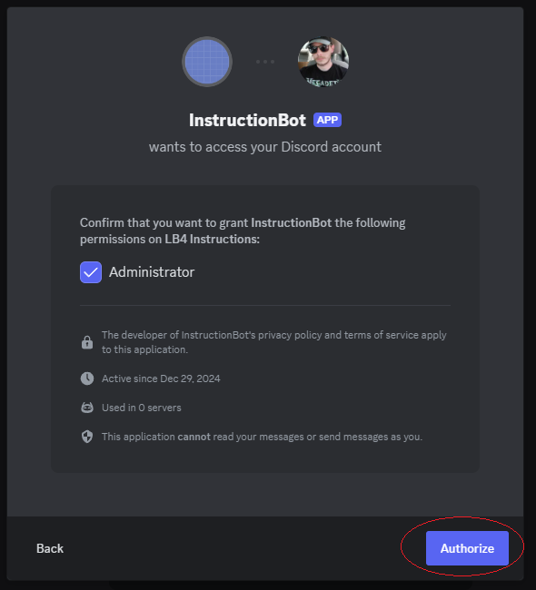

You should now see the Bot in the designated server.
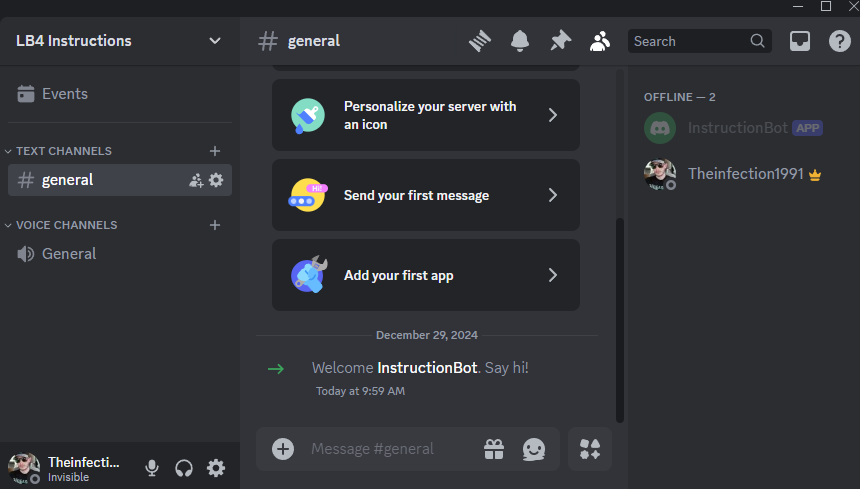

---

### Step 5: Regenerate Discord Token

The last thing I do now is regenerate the Bot Token that we will need to give LadderBot4. Navigate back to the **Bot** tab in the Discord Developer Portal. 
 


Now click **Reset Token** and then click **Yes, do it!" in the following popup. Discord will have you re-enter your password to Reset the Token.

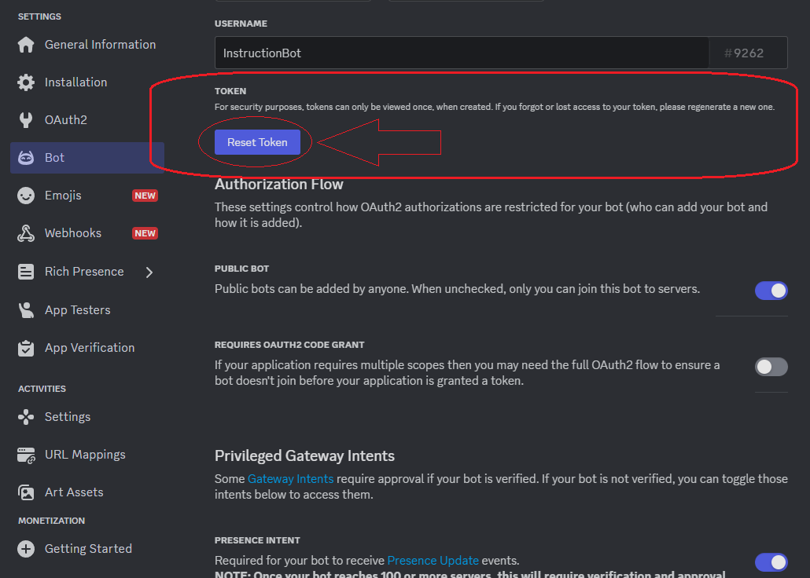

You should now see something similar to what's below. You'll get a long string of numbers, letters and some periods in it. This is the Discord Bot Token and is required for the bot to work. Hold on to this, keep it safe. If you lose it, you'll need to Reset it again.

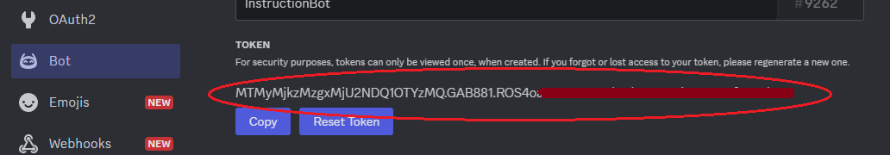

This completes the Get instructions of the Discord Token, again hold on to it as we will need it once we run the bot.
---

## How To Create Private GitHub Repo And Find Git HTTPS URL Path (Backup Storage)

With Ladderbot4 comes the new ability to backup every .json file (besides config.json as it holds sensitive token information) directly to a GitHub Repo you own or have permission to. Creating a repo is free and easy. I recommend creating a private repo but it's up to you. 

---

### Step 1: Login and Create New Repo
First, navigate to the [GitHub Home Page](https://github.com/). Log in if needed, then click the `+` button and select `New repository`.

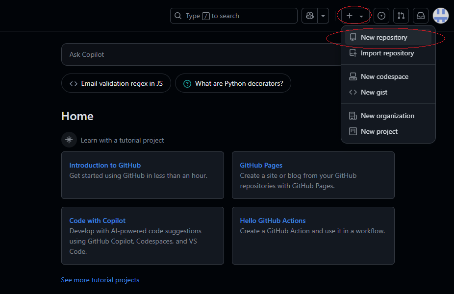

Choose a **Repository name** and see if it's available. Again, I recommend making the repository private so click the **Private** tick circle and then click **Create repository**.

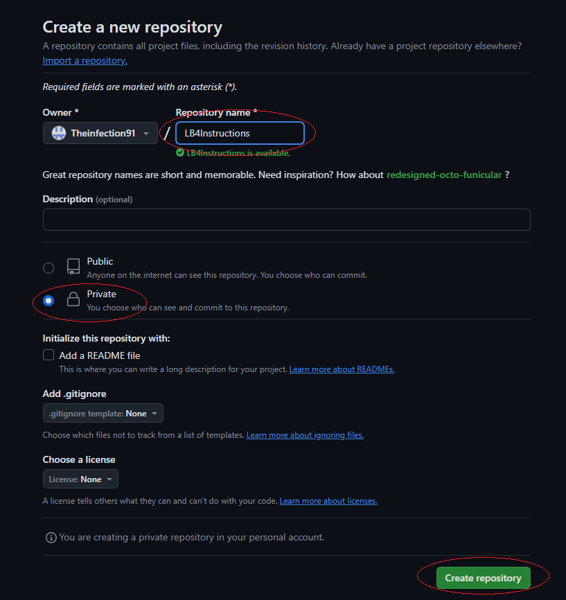

---

### Step 2: Find Git HTTPS Url Path

You'll now be moved inside of the repository and the last thing you need to do is copy down the HTTPS Url it gives you. You will need this for the Git Backup Storage process as well when it asks for the **Git HTTPS URL Path**. You can always come back to this repo and find this link again, it will not change unless you rename the repo.

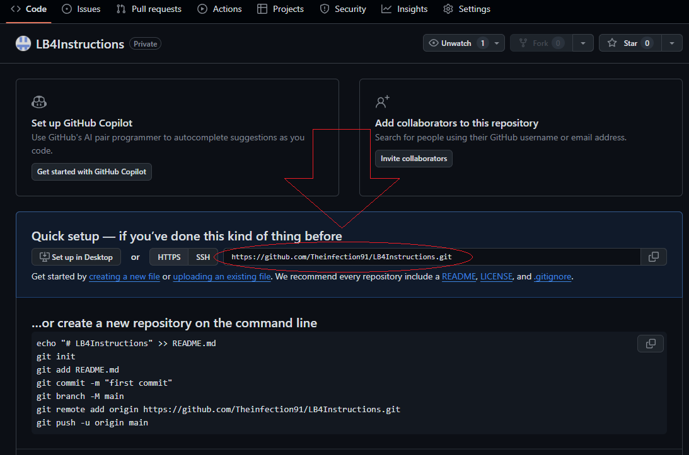

**HINT** If you marked your Repo as private but want others you trust to see it, invite their GitHub account as a collaborator in the repo's Settings.
---

## How To Generate a GitHub PAT Token (Backup Storage)

To use your GitHub repository as a backup storage system for the database `.json` files, you need to generate a **GitHub PAT Token** that targets the repository of your choice. Follow the instructions below:

---

### Step 1: Access Settings
On the GitHub Desktop site, navigate to your **Settings**.

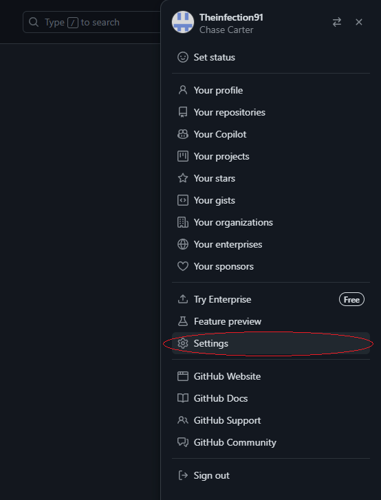

---

### Step 2: Open Developer Settings
In the left-hand menu, scroll down and select **Developer settings**.

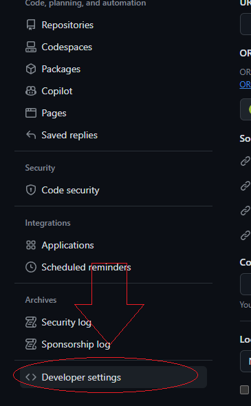

---

### Step 3: Generate a New Fine-Grained Token
Click on **Fine-grained tokens** and then select **Generate new token**.

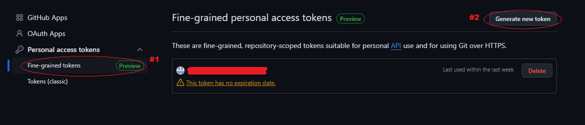

---

### Step 4: Configure Token Details
1. **Name**: Enter a name for the token. This can be any descriptive name and is not used in the program.
2. **Expiration**: Choose an expiration date. It is recommended to set **"No expiration"** since the token will be used for long-term backups. This is optional and depends on your security needs.
3. **Repository Access**: Under **Repository Access**, select **Only select repositories** and choose the specific repository the token will target.

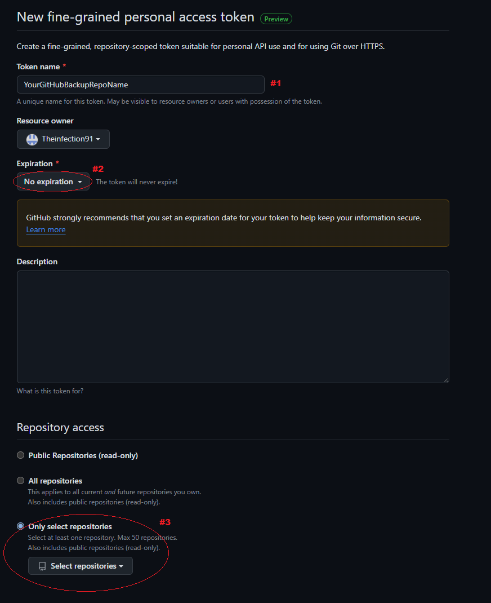

---

### Step 5: Set Repository Permissions
Under **Repository Permissions**, locate **Contents** and set it to **Read and Write**. This will automatically enable **Metadata** as a required permission. You should now have **2 permissions** selected: **Contents** and **Metadata**.

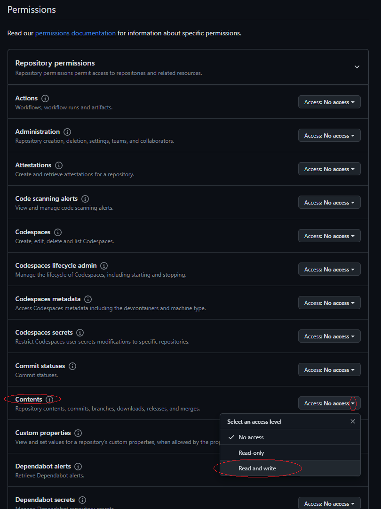

---

### Step 6: Generate the Token
Click **Generate Token** to finalize the process.

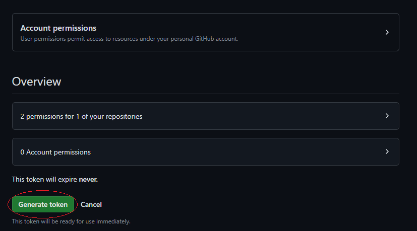

---

### Step 7: Save Your Token
Once the token is generated, **copy the token string** and store it securely. If you lose this token, you will need to regenerate it.

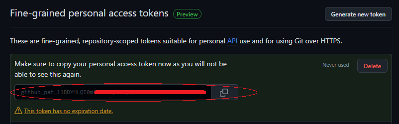

> **Note:** The generated token is required for the program to connect to GitHub and perform backup operations. It must be stored in your program’s configuration file securely.   
---

## Running Ladderbot4.exe and Initial Bot Setup
Now that we have a **Discord Bot Token**, the **Git PAT Token**, and the **Git HTTPS Url Path** we can fire up **Ladderbot4** for the first time! Download the latest release of Ladderbot4 [HERE](https://github.com/Theinfection91/Ladderbot4/releases/download/v4.1.0/v4.1.0-Ladderbot4-win_x64.zip) or from my Releases section in this Repo and extract the contents of the .zip file into a folder of your choosing. Run the `Ladderbot4.exe` file and follow these instructions:

### Step 1: Enter Discord Bot Token

Upon running the `.exe` file you'll be welcomed immediately with Windows saying it protected your PC from my Bot. Since this is a small project it is not digitally signed and thus Windows does this. I can assure you there is nothing malicious about this program, but if this warning scares you then you're free to stop the setup now and not use this bot. To bypass this, just click **More Info** and then **Run anyway**

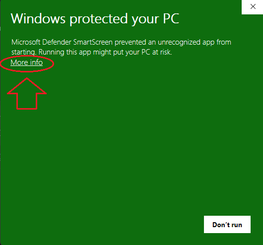

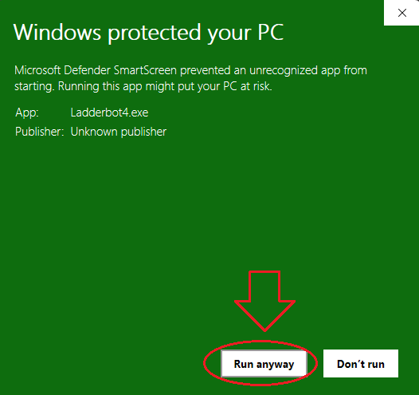

Once you are passed the Security Check you'll be greeted with a Command Prompt looking window, it might not look like much but this is **Ladderbot4**. You also may or may not have noticed a new folder was created in the folder you extracted the `.zip` to. A few different folders and files will be created while the bot finishes this set up process. The `config.json` that was just created and stored in the new `Settings` folder is where all the sensitive information we are about to enter will go. This file will not be uploaded to a Git Repo if Backup Storage is setup. 

Now, The first thing the Bot is going to ask you for is the **Discord Bot Token** that we acquired earlier. Copy and paste it into the program now and then press `Enter` on your keyboard.

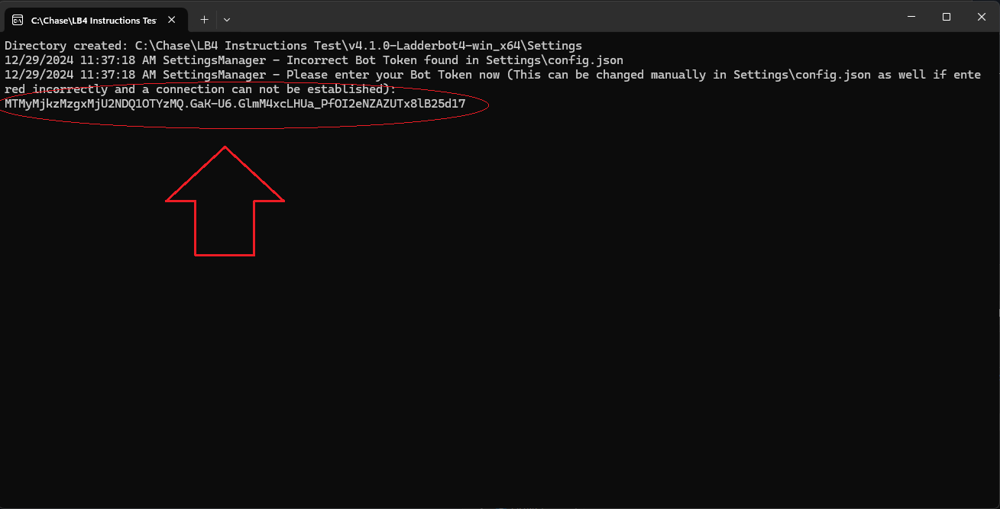

---

### Step 2: Enter Git PAT Token and HTTPS Path

The second bit of information the bot asks for is the **Git PAT Token** we generated earlier as well. This option can be skipped for now by entering 0 but it is highly recommended to set this up and have backup storage available online in case the bot goes offline for some reason. Copy and paste the token or enter 0 now.

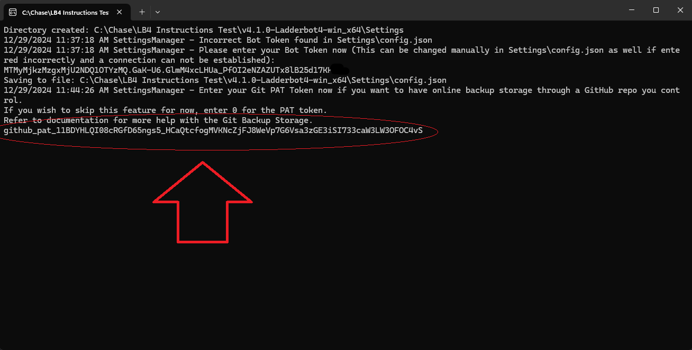

Now it asks for that **Git HTTPS Url Path** that we copied once we made our private repository on GitHub earlier. Copy and paste this into the program now.

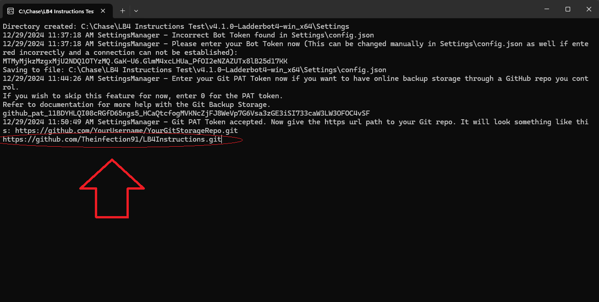

You should now see the output say something about `GitBackupManager - No local repo found. Cloning repository...` and `GitBackupManager - Repository cloned successfully.`. If so, the Git PAT Token and Git HTTPS Url Path worked and are now linked together. Once event driven data forces `.json` files to change it will automatically backup our files to that repo!

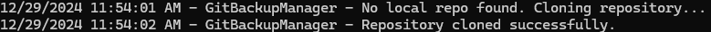

---

### Step 3: Copy and Paste Guild ID From List

Time to locate the Guild ID of the server and give it to the bot. Luckily, I got you on this one. The bot will now dynamically check every server its connected to and give you a list of ID's to choose from. Seeing as how only you invited this one, there should be only one on this list. **CAREFULLY** copy and paste the number. If you hit Ctrl+C twice in fast succession you will close the bot... This is a Windows feature and will look to work code around it one day but for now just be careful. Copy the ID and then paste it right back to the bot and hit `Enter` on your keyboard. This allows for the interactive SlashCommands to immediately show in the given server, instead of waiting up to an hour sometimes for Discord to populate them globally.

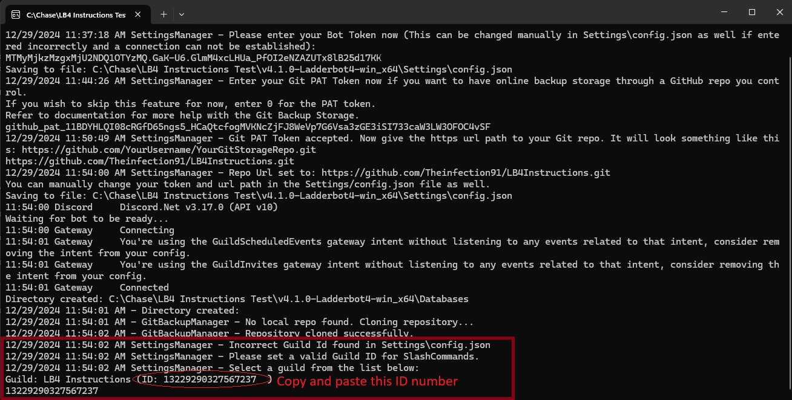

---

### Step 4: Checking Commands and Backup Storage

Your window should now look similar to mine, with it saying the bot is logged in as the name you assigned it in the Discord Developer Portal and showing the Guild ID again as well as stating it is `Ready`. You will also see the bot online in your server now when the `.exe` is running. If you entered anything incorrectly, exit the bot and edit the `config.json` file in the Settings folder then save it and reload and check the bot again.

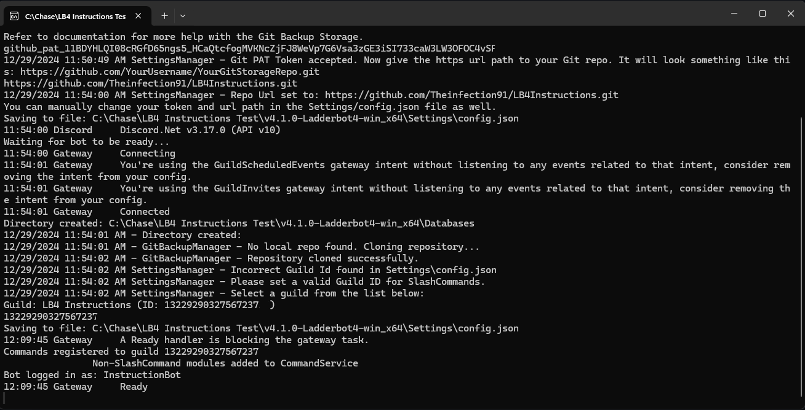

Let's enter our first command and get things started. By pressing `/` on your keyboard in the text input bar of your Discord server the bot is assigned to you should see all of the interactive SlashCommands under a category by the name in which you assigned the bot in the Discord Developer Portal. SlashCommands allow for easy auto-fill and show you the arguments that are required to be passed to the commands before they can be properly executed. If these did not appear then your Guild ID was entered incorrectly. 

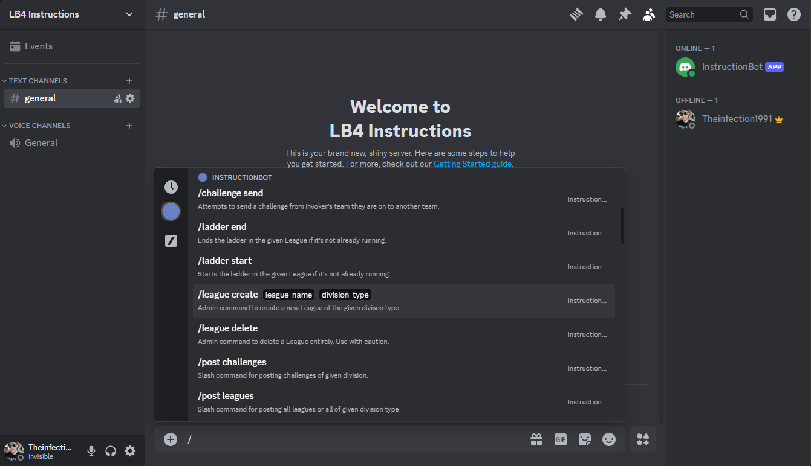

To get things going we first need a league in which to register teams into. Let's create a league with `/league create`. Try hitting `/` and start even typing `/crea` and the interactive suggestions even start to limit the result to just `/league create`. You can now just hit `Tab` and auto populate the data into the input bar. You'll notice this format of commands even show the arguments needed for the command. I'll start off by creating a simple 1v1 Test league to make sure everything is working properly.

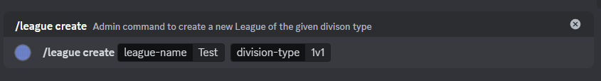

TODO

---

## Using Commands
Extensive information and how to use the various commands in Ladderbot4:

## League Slash Commands

The `/league` commands allow administrators to manage leagues within Ladderbot. These commands provide functionality for creating and deleting leagues. Use them responsibly, as they directly modify league data.

### Create League Command (`/league create`)

**Description:**  
Creates a new league with the specified name and division type. Only administrators can use this command.

**Usage:**
```plaintext
/league create leagueName:<string> divisionType:<1v1|2v2|3v3>
```

**Parameters:**  
- `leagueName` (string): The name of the league to create. Must be unique.  
- `divisionType` (1v1, 2v2, 3v3): The type of division for the league. Must be one of the valid division types.

**Process:**  
1. Checks if the league name is unique.  
2. Verifies the division type is valid (`1v1`, `2v2`, or `3v3`).  
3. Creates a new league object and adds it to the database.  
4. Saves and reloads the leagues database.  
5. Creates a new state object for the league and adds it to the states database.  
6. Backs up all changes to Git.  
7. Returns a success or error embed based on the operation outcome.

**Success Response Example:**  
- League creation is successful:
  "🏆 League Created: TestLeague (2v2)"

**Error Response Examples:**  
- Invalid division type:
  "❌ Invalid Division Type given: 4v4. Choose between 1v1, 2v2, or 3v3."

- Duplicate league name:
  "❌ The given League Name (TestLeague) is already taken. Choose another name for the new League."

---

### Delete League Command (`/league delete`)

**Description:**  
Deletes a league with the specified name. This command is irreversible and should be used with caution. Only administrators can use this command.

**Usage:**  
/league delete leagueName:<string>

**Parameters:**  
- `leagueName` (string): The name of the league to delete. Must match an existing league.

**Process:**  
1. Loads the latest league database.  
2. Checks if the league exists.  
3. Removes all challenges associated with the league from `challenges.json`.  
4. Deletes the league from the database.  
5. Saves and reloads the leagues database.  
6. Removes the associated state from the states database.  
7. Backs up all changes to Git.  
8. Returns a success or error embed based on the operation outcome.

**Success Response Example:**  
- League deletion is successful:
  "✅ League Deleted: TestLeague (2v2)"

**Error Response Examples:**  
- League not found:
  "❌ No League was found by the given League Name: TestLeague"

- Internal error with null league object:
  "❌ The League object that was found was null. Contact the bot's admin."

---

## Team Slash Commands

The `/team` commands allow administrators to manage teams in Ladderbot. These commands cover registering and removing teams, as well as modifying team stats.

---

### Register Team Command (`/team register`)

**Description:**  
Registers a new team to a specified league. Only administrators can use this command.

**Usage:**
```plaintext
/team register teamName:<string> leagueName:<string> member1:<user> [member2:<user>] [member3:<user>]
```

**Parameters:**  
- `teamName` (string): The name of the team to be registered. Must be unique.  
- `leagueName` (string): The name of the league to register the team to.  
- `member1` (user): The primary member of the team (required).  
- `member2` (user): The second member of the team (optional for 1v1).  
- `member3` (user): The third member of the team (optional for 1v1 and 2v2).

**Process:**  
1. Loads the latest leagues database.  
2. Checks if the league exists.  
3. Verifies the team name is unique within the league.  
4. Converts the users into `Member` objects.  
5. Ensures the correct number of members for the league's division type (e.g., 1 for 1v1, 2 for 2v2).  
6. Checks if any member is already on another team in the same league.  
7. Creates a new `Team` object and assigns it to the league.  
8. Updates the leagues database and backs it up to Git.  
9. Returns a success or error embed based on the operation outcome.

**Success Response Example:**  
- Team registration is successful:  
  "✅ Team Registered: ExampleTeam in ExampleLeague (2v2)"

**Error Response Examples:**  
- Incorrect number of members:  
  "❌ Incorrect amount of members given for specified division type: Division - 2v2 | Member Count - 1."

- Duplicate team name:  
  "❌ The given team name is already being used by another team: ExampleTeam."

- League not found:  
  "❌ No league found with the name: ExampleLeague."

---

### Remove Team Command (`/team remove`)

**Description:**  
Removes an existing team from all leagues. Only administrators can use this command.

**Usage:**  
```plaintext
/team remove teamName:<string>
```

**Parameters:**  
- `teamName` (string): The name of the team to be removed.

**Process:**  
1. Loads the latest leagues database.  
2. Checks if the team exists in any league.  
3. Removes any challenges involving the team.  
4. Deletes the team from the league and reassigns ranks.  
5. Updates the leagues database and backs it up to Git.  
6. Returns a success or error embed based on the operation outcome.

**Success Response Example:**  
- Team removal is successful:  
  "✅ Team Removed: ExampleTeam from ExampleLeague (2v2)"

**Error Response Examples:**  
- Team not found:  
  "❌ No team found with the name: ExampleTeam."

  ---

  ## Team Stats Modification Commands

These commands allow administrators to modify a team's win or loss count in Ladderbot. The following commands add or subtract wins and losses, while ensuring that counts cannot go negative.

---

### Add Win Command (`/team add win`)

**Description:**  
Adds a specified number of wins to a team. Only administrators can use this command.

**Usage:**  
```plaintext
/team add win teamName:<string> numberOfWins:<int>
```

**Parameters:**  
- `teamName` (string): The name of the team to add wins to.  
- `numberOfWins` (int): The number of wins to add.

**Process:**  
1. Checks if the team exists in the leagues database.  
2. Adds the specified number of wins to the team.  
3. Updates and saves the leagues database.  
4. Backs up the database to Git.  
5. Returns a success or error embed based on the operation outcome.

**Success Response Example:**  
- Wins added successfully:  
  "✅ Wins Added: ExampleTeam | Wins: +3"

**Error Response Example:**  
- Team not found:  
  "❌ No team found with the name: ExampleTeam"

---

### Subtract Win Command (`/team subtract win`)

**Description:**  
Subtracts a specified number of wins from a team. Ensures that the team's win count does not go negative. Only administrators can use this command.

**Usage:**  
```plaintext
/team subtract win teamName:<string> numberOfWins:<int>
```

**Parameters:**  
- `teamName` (string): The name of the team to subtract wins from.  
- `numberOfWins` (int): The number of wins to subtract.

**Process:**  
1. Checks if the team exists in the leagues database.  
2. Subtracts the specified number of wins, ensuring the result is not negative.  
3. Updates and saves the leagues database.  
4. Backs up the database to Git.  
5. Returns a success or error embed based on the operation outcome.

**Success Response Example:**  
- Wins subtracted successfully:  
  "✅ Wins Subtracted: ExampleTeam | Wins: -2"

**Error Response Examples:**  
- Team not found:  
  "❌ No team found with the name: ExampleTeam"
- Negative result (cannot subtract more than the current wins):  
  "❌ Cannot subtract that many wins from ExampleTeam. The result would be negative."

---

### Add Loss Command (`/team add loss`)

**Description:**  
Adds a specified number of losses to a team. Only administrators can use this command.

**Usage:**  
```plaintext
/team add loss teamName:<string> numberOfLosses:<int>
```

**Parameters:**  
- `teamName` (string): The name of the team to add losses to.  
- `numberOfLosses` (int): The number of losses to add.

**Process:**  
1. Checks if the team exists in the leagues database.  
2. Adds the specified number of losses to the team.  
3. Updates and saves the leagues database.  
4. Backs up the database to Git.  
5. Returns a success or error embed based on the operation outcome.

**Success Response Example:**  
- Losses added successfully:  
  "✅ Losses Added: ExampleTeam | Losses: +1"

**Error Response Example:**  
- Team not found:  
  "❌ No team found with the name: ExampleTeam"

---

### Subtract Loss Command (`/team subtract loss`)

**Description:**  
Subtracts a specified number of losses from a team. Ensures that the team's loss count does not go negative. Only administrators can use this command.

**Usage:**  
```plaintext
/team subtract loss teamName:<string> numberOfLosses:<int>
```

**Parameters:**  
- `teamName` (string): The name of the team to subtract losses from.  
- `numberOfLosses` (int): The number of losses to subtract.

**Process:**  
1. Checks if the team exists in the leagues database.  
2. Subtracts the specified number of losses, ensuring the result is not negative.  
3. Updates and saves the leagues database.  
4. Backs up the database to Git.  
5. Returns a success or error embed based on the operation outcome.

**Success Response Example:**  
- Losses subtracted successfully:  
  "✅ Losses Subtracted: ExampleTeam | Losses: 2"

**Error Response Examples:**  
- Team not found:  
  "❌ No team found with the name: ExampleTeam"
- Negative result (cannot subtract more than the current losses):  
  "❌ Cannot subtract that many losses from ExampleTeam. The result would be negative."

---

## Ladder Management Commands

These commands allow administrators to start or end the ladder for a specified league.

---

### Start Ladder Command (`/ladder start`)

**Description:**  
Starts the ladder for a specified league if it is not already running. Only administrators can use this command.

**Usage:**  
```plaintext
/ladder start leagueName:<string>
```

**Parameters:**  
- `leagueName` (string): The name of the league to start the ladder in.

**Process:**  
1. Checks if the league exists.  
2. If the league exists and the ladder is not already running, the ladder will be started.  
3. Updates and saves the states database.  
4. Backs up the database to Git.  
5. Returns a success or error embed based on the operation outcome.

**Success Response Example:**  
- Ladder started successfully:  
  "✅ Ladder Started: LeagueName | The ladder has been successfully started."

**Error Response Examples:**  
- League not found:  
  "❌ No league found with the name: LeagueName"
- Ladder already running:  
  "❌ The ladder is already running for LeagueName."

---

### End Ladder Command (`/ladder end`)

**Description:**  
Ends the ladder for a specified league if it is currently running. Only administrators can use this command.

**Usage:**  
```plaintext
/ladder end leagueName:<string>
```

**Parameters:**  
- `leagueName` (string): The name of the league to end the ladder in.

**Process:**  
1. Checks if the league exists.  
2. If the league exists and the ladder is currently running, the ladder will be stopped.  
3. Updates and saves the states database.  
4. Backs up the database to Git.  
5. Returns a success or error embed based on the operation outcome.

**Success Response Example:**  
- Ladder ended successfully:  
  "✅ Ladder Ended: LeagueName | The ladder has been successfully ended."

**Error Response Examples:**  
- League not found:  
  "❌ No league found with the name: LeagueName"
- Ladder not running:  
  "❌ The ladder is not currently running for LeagueName."

---

## Challenge Commands

These commands allow users to send or cancel challenges in the ladder system.

---

### Send Challenge Command (`/challenge send`)

**Description:**  
Sends a challenge from the invoker's team to another team. The challenger must be part of the team they are sending the challenge from.

**Usage:**
```plaintext
/challenge send challengerTeam:<string> challengedTeam:<string>
```

**Parameters:**  
- `challengerTeam` (string): The name of the team sending the challenge.  
- `challengedTeam` (string): The name of the team receiving the challenge.

**Process:**  
1. Verifies if both teams exist in the database.  
2. Checks if the ladder is running for the league.  
3. Ensures that both teams are in the same league and within the allowed rank range for challenges.  
4. Confirms that neither team has a pending challenge.  
5. If valid, creates the challenge and notifies the challenged team.  
6. Updates and backs up the database.

**Success Response Example:**  
- Challenge sent successfully:  
  "✅ Challenge Sent: Team {challengerTeam} has successfully challenged Team {challengedTeam}."

**Error Response Examples:**  
- One or both teams not found:  
  "❌ One or both team names were not found in the database. Please try again."
- Ladder not running:  
  "❌ The ladder is not currently running in {leagueName}. Challenges cannot be initiated yet."
- Rank issue:  
  "❌ Team {challengerTeam}'s rank is not within the allowed range to challenge {challengedTeam}. A challenge can only be made for teams within two ranks above."
- Pending challenge:  
  "❌ Team {challengedTeam} is already awaiting a challenge match. Please try again later."

---

### Cancel Challenge Command (`/challenge cancel`)

**Description:**  
Cancels a challenge sent by the invoker's team. The invoker must be part of the team that sent the challenge.

**Usage:**  
```plaintext
/challenge cancel challengerTeam:<string>
```

**Parameters:**  
- `challengerTeam` (string): The name of the team that sent the challenge.

**Process:**  
1. Verifies if the team exists in the database.  
2. Checks if the ladder is running for the league.  
3. Confirms that the invoker is part of the challenger team.  
4. Ensures the team has an active challenge to cancel.  
5. If valid, cancels the challenge and updates the teams' status.

**Success Response Example:**  
- Challenge canceled successfully:  
  "✅ Challenge Canceled: The challenge from Team {challengerTeam} to Team {challengedTeam} has been successfully canceled."

**Error Response Examples:**  
- No pending challenge:  
  "❌ Team {challengerTeam} does not have any pending challenges to cancel."
- Team not found:  
  "❌ The team {challengerTeam} was not found in the database. Please try again."
- Not a team member:  
  "❌ You are not a member of Team {challengerTeam}. Please try again."

  ## Admin Challenge Commands

These commands allow administrators to send or cancel challenges between teams in the ladder system.

---

### Send Challenge Command (`/challenge admin send`)

**Description:**  
Allows an administrator to send a challenge from one team to another team.

**Usage:**
```plaintext
/challenge admin send challengerTeam:<string> challengedTeam:<string>
```

**Parameters:**  
- `challengerTeam` (string): The name of the team sending the challenge.  
- `challengedTeam` (string): The name of the team receiving the challenge.

**Process:**  
1. Verifies if both teams exist in the league.  
2. Ensures that the ladder is running for the league.  
3. Checks if both teams are in the same league and that the challenge is within the allowed rank range.  
4. Confirms that neither team has a pending challenge.  
5. If valid, creates a new challenge and notifies the challenged team.  
6. Updates the challenge status of both teams and backs up the database.

**Success Response Example:**  
- Challenge sent successfully:  
  "✅ Challenge Sent: Team {challengerTeam} has successfully challenged Team {challengedTeam}."

**Error Response Examples:**  
- One or both teams not found:  
  "❌ One or both teams were not found in the database. Please try again."
- Ladder not running:  
  "❌ The ladder is not currently running in {leagueName}. Challenges cannot be initiated yet."
- Teams not in same league:  
  "❌ The teams are not in the same League. Challenger team's League: {challengerTeam.League}, Challenged team's League: {challengedTeam.League}."
- Rank issue:  
  "❌ Team {challengerTeam}'s rank is not within the allowed range to challenge {challengedTeam}. A challenge can only be made for teams within two ranks above."
- Pending challenge:  
  "❌ Team {challengerTeam} is already awaiting a challenge match. Please try again later."
  
---

### Cancel Challenge Command (`/challenge admin cancel`)

**Description:**  
Allows an administrator to cancel a challenge from the invoker's team.

**Usage:**  
```plaintext
/challenge admin cancel challengerTeam:<string>
```

**Parameters:**  
- `challengerTeam` (string): The name of the team that sent the challenge.

**Process:**  
1. Verifies if the team exists in the database.  
2. Confirms that the team has an active challenge to cancel.  
3. If valid, cancels the challenge and updates the status of both teams.

**Success Response Example:**  
- Challenge canceled successfully:  
  "✅ Challenge Canceled: The challenge from Team {challengerTeam} to Team {challengedTeam} has been successfully canceled."

**Error Response Examples:**  
- No active challenge:  
  "❌ Team {challengerTeam} does not have any active challenges to cancel."
- Team not found:  
  "❌ The team {challengerTeam} was not found in the database. Please try again."
- Not a member of the team:  
  "❌ You are not a member of Team {challengerTeam}. Please try again."

---

## Report Commands

These commands allow users and administrators to report match outcomes in the ladder system.

---

### Report Win Command (`/report win`)

**Description:**  
Allows a user to report the winning team of a match.

**Usage:**  
```plaintext
/report win winningTeamName:<string>
```

**Parameters:**  
- `winningTeamName` (string): The name of the team that won the match.

**Process:**  
1. Verifies if the given team exists in the database.
2. Fetches the league where the team belongs.
3. Checks if the ladder is currently running for the league.
4. Verifies that the invoker is part of the winning team.
5. Confirms if the winning team is involved in an active challenge.
6. If the winning team is the challenger, adjusts the rank of both the winning and losing teams.
7. Adds the win and loss to the respective teams.
8. Updates challenge statuses and removes the challenge from the system.
9. Backs up the updated data to Git.
10. Returns a success embed with details of the rank change if the team was the challenger, otherwise with no rank change.

**Success Response Example:**  
- Win reported successfully:  
  "✅ Win Reported: Team {winningTeamName} has been successfully recorded as the winner."

**Error Response Examples:**  
- Team not found:  
  "❌ The team {winningTeamName} was not found in the database. Please try again."
- Ladder not running:  
  "❌ The ladder is not currently running in {leagueName}. Challenges cannot be reported on yet."
- Not part of team:  
  "❌ You are not part of Team **{winningTeamName}**\nThat team's members are: {teamMembersList}."
- No active challenge:  
  "❌ Team {winningTeamName} is not currently waiting on a challenge match."

---

### Admin Report Win Command (`/report admin win`)

**Description:**  
Allows an administrator to report the winning team of a match. This command bypasses user-level restrictions and can be used for handling matches requiring admin intervention.

**Usage:**  
```plaintext
/report admin win winningTeamName:<string>
```

**Parameters:**  
- `winningTeamName` (string): The name of the team that won the match.

**Process:**  
1. Verifies if the given team exists in the database.
2. Fetches the league where the team belongs.
3. Checks if the ladder is currently running for the league.
4. Confirms that the winning team is involved in an active challenge.
5. Determines if the winning team is the challenger or the challenged team.
6. If the team is the challenger, adjusts the rank of both the winning and losing teams.
7. Adds the win and loss to the respective teams.
8. Updates challenge statuses and removes the challenge from the system.
9. Backs up the updated data to Git.
10. Returns a success embed with details of the rank change if the team was the challenger, otherwise with no rank change.

**Success Response Example:**  
- Win reported successfully by admin:  
  "✅ Win Reported: Team {winningTeamName} has been successfully recorded as the winner by admin."

**Error Response Examples:**  
- Team not found:  
  "❌ The team {winningTeamName} was not found in the database. Please try again."
- Ladder not running:  
  "❌ The ladder is not currently running in {leagueName}. Challenges cannot be reported on yet."
- No active challenge:  
  "❌ Team {winningTeamName} is not currently waiting on a challenge match."
- Admin permission error:  
  "❌ You do not have the required permissions to execute this command."
---
## Post Commands

These commands allow users to post various types of data related to the ladder system, such as challenges, leagues, standings, and teams.

---

### Post Challenges Command (`/post challenges`)

**Description:**  
Posts challenge data for a given league.

**Usage:**  
```plaintext
/post challenges leagueName:<string>
```

**Parameters:**  
- `leagueName` (string): The name of the league to fetch and post challenges for.

**Process:**  
1. Load the challenge database.
2. Check if the league exists by name.
3. If the league exists, fetch active challenges for the league.
4. Use the `PostChallengesEmbed` method to format the challenges data as an embed.
5. If the league does not exist, return an error embed stating the league could not be found.

**Success Response Example:**  
- Active challenges for the league:  
  "⚔️ Active Challenges - **LeagueName** (DivisionType League)\nCurrent challenges for league: \n\n{challenger} (Rank) 🆚 {challenged} (Rank)\n**Created On:** {date}"

**Error Response Example:**  
- League not found:  
  "❌ The league **LeagueName** does not exist."

---

### Post Standings Command (`/post standings`)

**Description:**  
Posts standings data for a given league.

**Usage:** 
```plaintext
/post standings leagueName:<string>
```

**Parameters:**  
- `leagueName` (string): The name of the league to fetch and post standings for.

**Process:**  
1. Load the league database.
2. Check if the league exists by name.
3. If the league exists, fetch standings for the league.
4. Use the `PostStandingsEmbed` method to format the standings data as an embed.
5. If the league does not exist, return an error embed stating the league could not be found.

**Success Response Example:**  
- Current standings for the league:  
  "🏆 Standings - **LeagueName** (DivisionType League)\nCurrent standings for league:\n\n#1 TeamName\n**Wins:** 10 | **Losses:** 2\n**Win Streak:** 5\n**Loss Streak:** 0\n**Win Ratio:** 83.33%"

**Error Response Example:**  
- League not found:  
  "❌ The league **LeagueName** does not exist."

---

### Post Teams Command (`/post teams`)

**Description:**  
Posts team data for a given league.

**Usage:** 
```plaintext
/post teams leagueName:<string>
```

**Parameters:**  
- `leagueName` (string): The name of the league to fetch and post team data for.

**Process:**  
1. Check if the league exists by name.
2. If the league exists, fetch the list of teams.
3. Use the `PostTeamsEmbed` method to format the teams data as an embed.
4. If the league does not exist, return an error embed stating the league could not be found.

**Success Response Example:**  
- Teams in the league by rank:  
  "🛡️ Teams - **LeagueName** (DivisionType League)\nCurrent teams in league by rank:\n\nTeamName (Rank)\n**Members:** Member1, Member2\n**Challenge Status:** Free"

**Error Response Example:**  
- League not found:  
  "❌ The league **LeagueName** does not exist."

---

## Set Commands

These commands allow admins to set specific configurations related to ranks, channels, and other settings.

---

### Set Rank Command (`/set rank`)

**Description:**  
Sets the specified rank for a given team.

**Usage:**  
```plaintext
/set rank teamName:<string> rank:<int>
```

**Parameters:**  
- `teamName` (string): The name of the team whose rank will be changed.
- `rank` (int): The new rank to assign to the team.

**Process:**  
1. Check if the user has administrator permissions.
2. Parse the team name and rank from the input.
3. Call the `SetRankProcess` method to update the team's rank.
4. Return the result in an embed.

**Success Response Example:**  
- Rank set successfully:  
  "✅ The rank for team **TeamName** has been successfully set to **Rank**."

**Error Response Example:**  
- Team not found:  
  "❌ The team **TeamName** could not be found."
- Invalid rank:  
  "❌ The rank **Rank** is not valid. Please provide a valid rank."

---

### Set Challenges Channel Command (`/set challenges_channel_id`)

**Description:**  
Sets the dynamic challenges message channel for a given league.

**Usage:**
```plaintext
/set challenges_channel_id leagueName:<string> channel:<IMessageChannel>
```

**Parameters:**  
- `leagueName` (string): The name of the league for which the challenges channel will be set.
- `channel` (IMessageChannel): The channel to set for the challenges messages.

**Process:**  
1. Check if the user has administrator permissions.
2. Parse the league name and channel.
3. Call the `SetChallengesChannelIdProcess` method to update the channel for challenges.
4. Return the result in an embed.

**Success Response Example:**  
- Channel set successfully:  
  "✅ The challenges channel for league **LeagueName** has been successfully set to **ChannelName**."

**Error Response Example:**  
- League not found:  
  "❌ The league **LeagueName** could not be found."
- Invalid channel:  
  "❌ The channel **ChannelName** could not be set."

---

### Set Standings Channel Command (`/set standings_channel_id`)

**Description:**  
Sets the dynamic standings message channel for a given league.

**Usage:**  
```plaintext
/set standings_channel_id leagueName:<string> channel:<IMessageChannel>
```

**Parameters:**  
- `leagueName` (string): The name of the league for which the standings channel will be set.
- `channel` (IMessageChannel): The channel to set for the standings messages.

**Process:**  
1. Check if the user has administrator permissions.
2. Parse the league name and channel.
3. Call the `SetStandingsChannelIdProcess` method to update the channel for standings.
4. Return the result in an embed.

**Success Response Example:**  
- Channel set successfully:  
  "✅ The standings channel for league **LeagueName** has been successfully set to **ChannelName**."

**Error Response Example:**  
- League not found:  
  "❌ The league **LeagueName** could not be found."
- Invalid channel:  
  "❌ The channel **ChannelName** could not be set."

---

### Set Teams Channel Command (`/set teams_channel_id`)

**Description:**  
Sets the dynamic teams message channel for a given league.

**Usage:**  
```plaintext
/set teams_channel_id leagueName:<string> channel:<IMessageChannel>
```

**Parameters:**  
- `leagueName` (string): The name of the league for which the teams channel will be set.
- `channel` (IMessageChannel): The channel to set for the teams messages.

**Process:**  
1. Check if the user has administrator permissions.
2. Parse the league name and channel.
3. Call the `SetTeamsChannelIdProcess` method to update the channel for teams.
4. Return the result in an embed.

**Success Response Example:**  
- Channel set successfully:  
  "✅ The teams channel for league **LeagueName** has been successfully set to **ChannelName**."

**Error Response Example:**  
- League not found:  
  "❌ The league **LeagueName** could not be found."
- Invalid channel:  
  "❌ The channel **ChannelName** could not be set."

---

## Settings Commands

These commands allow admins to modify specific settings in the bot's configuration file (`config.json`).

---

### Super Admin On/Off Command (`/settings super_admin_on_off`)

**Description:**  
Toggles the Super Admin mode on or off.

**Usage:**  
```plaintext
/settings super_admin_on_off onOrOff:<string>
```

**Parameters:**  
- `onOrOff` (string): Either `on` to enable Super Admin mode or `off` to disable it.

**Process:**  
1. Check if the user has administrator permissions.
2. Parse the `onOrOff` parameter to determine the mode.
3. Call the `SetSuperAdminModeOnOffProcess` method to update the setting.
4. Return the result in an embed.

**Success Response Example:**  
- Super Admin mode enabled:  
  "✅ Super Admin mode has been enabled."
- Super Admin mode disabled:  
  "✅ Super Admin mode has been disabled."

**Error Response Example:**  
- Invalid input:  
  "❌ Please provide either `on` or `off` to set the Super Admin mode."

---

### Add Super Admin ID Command (`/settings add_admin_id`)

**Description:**  
Adds a given user's ID to the list of Super Admins in the configuration file.

**Usage:**  
```plaintext
/settings add_admin_id user:<IUser>
```

**Parameters:**  
- `user` (IUser): The user to be added to the list of Super Admins.

**Process:**  
1. Check if the user has administrator permissions.
2. Parse the user parameter.
3. Call the `AddSuperAdminIdProcess` method to add the user.
4. Return the result in an embed.

**Success Response Example:**  
- User added as Super Admin:  
  "✅ **UserName** has been added as a Super Admin."

**Error Response Example:**  
- User already an admin:  
  "❌ **UserName** is already a Super Admin."
- Invalid user:  
  "❌ The user **UserName** could not be found."

---

### Remove Super Admin ID Command (`/settings remove_admin_id`)

**Description:**  
Removes a given user's ID from the list of Super Admins in the configuration file.

**Usage:** 
```plaintext
/settings remove_admin_id user:<IUser>
```

**Parameters:**  
- `user` (IUser): The user to be removed from the list of Super Admins.

**Process:**  
1. Check if the user has administrator permissions.
2. Parse the user parameter.
3. Call the `RemoveSuperAdminIdProcess` method to remove the user.
4. Return the result in an embed.

**Success Response Example:**  
- User removed as Super Admin:  
  "✅ **UserName** has been removed from the Super Admin list."

**Error Response Example:**  
- User not found in Super Admin list:  
  "❌ **UserName** is not a Super Admin."
- Invalid user:  
  "❌ The user **UserName** could not be found."

---
