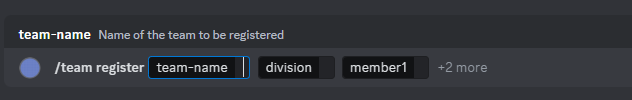
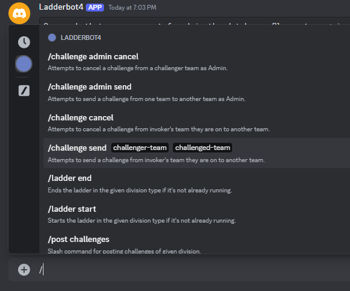
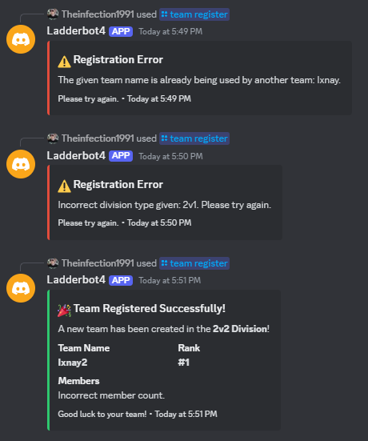

# Ladderbot4

## Overview
**Ladderbot4** is a robust and feature-rich Discord bot designed for managing competitive ladders in various divisions. This C# implementation significantly enhances performance and maintainability over its predecessor, Ladderbot3.0, leveraging dependency injection, a more modular architecture, and improved command handling like **SlashCommands** to add a more interactive experience and reduce errors.

This version also implements Discord embed in messages instead of just string in markdown to further highlight errors and also increase the overall beauty of the Bot's repsonses. The examples below may change slightly over time but this is a general idea of the appearance. 

Ladderbot4 is still under active development, but it offers a stable foundation with exciting new features and improvements to come over previous versions. Feedback and suggestions are always welcome to further refine and expand its capabilities.

For any questions, suggestions, or issues, feel free to submit them via the **Issues** tab or message me on Discord at `Theinfection1991`.

---

## Features

### New/In-Progress Functionalities:

- **(NEW) Git Backup Storage (Implemented And Working, But Needs Some Polishing)**:
  - The ability to use an owned GitHub Repo as a backup storage hub for the .json database files that are used for teams, challenges, states, and history.
 
- **(NEW) Match History (In-Progress, Needs User Commands To Read/Write Information To Discord)**:
   - Storing previous match results in the database to cross reference for later use in case messages or channels are deleted. I also plan to use Match History for writing tests.
 
- **(NEW) Embed Output (Implemented)**:
  - Previous versions only used string in Markdown format, **Ladderbot4** will now return embed objects as output to increase the overall readability for the user.

### Returning Features from Ladderbot3.0:

- **Ladder Management**:
  - Admins can start and end ladders for specific divisions (e.g., 1v1, 2v2, 3v3).

- **Team Management**:
  - Admin commands for registering and removing teams in specific divisions.

- **Challenge System**:
  - Allows teams to issue challenges, manage their status, and track results.
  - Admin overrides for manually creating or canceling challenges.

- **Match Reporting**:
  - Command-based reporting for match results that automatically update standings and rankings.
  - Admin commands to adjust results, ranks, and other metrics manually.

- **Standings, Challenges, Teams Channels**:
  - Post real-time standings and active challenges to designated channels.
  - Automatically update standings and challenge information.

- **Administrative Controls**:
  - Comprehensive admin controls for managing ladders, teams, ranks, wins, and losses.

---

## Planned Features
2. **Multiple Divisions Of The Same Type**:
   - I want to add the ability to have multiple divisions of the same type running at the same time (Example: Two 1v1's, three 2v2's or even 100 3v3's if need be)

2. **Stat Tracking and Achievements** (Began Background Work):
   - Track team and individual stats, possible stat ideas:
     - Number of matches played.
     - Rank changes during a ladder's lifetime.
     - Player achievements, such as participating in a champion team.
   - Implement achievements tied to Discord IDs and store data in the bot's database.

3. **Logging System** (Enhanced):
   - Plans to integrate bot commands to filter and view logs dynamically in Discord.
   - Logs command invocations, parameters, and errors
     
4. **Creative Additions**:
   - Open to suggestions for new features or improvements to the bot's current functionality.

---

## Rules of the Ladder System

### Team Rank Assignments
1. **New Teams**:
   - Teams are assigned ranks based on the order they are created in a division.
     - First team: Rank 1.
     - Second team: Rank 2.
     - Subsequent teams are assigned incrementally lower ranks.
   
2. **Divisions**:
   - The bot supports concurrent ladders for the following divisions:
     - **1v1**
     - **2v2**
     - **3v3**

### Challenges and Rank Changes
1. **Who Can Be Challenged**:
   - Teams **cannot challenge below their rank**.
   - Teams may only challenge **up to 2 ranks above them**.
     - Example: Rank 4 can challenge Rank 3 and Rank 2, but not Rank 1.

2. **Challenge Outcomes**:
   - **If the challenger wins**:
     - The challenger team takes the rank of the defeated team.
     - The defeated team is pushed **down one rank**, and all other teams below them are adjusted accordingly.
     - Example:
       - Rank 4 defeats Rank 2 → Rank 4 becomes Rank 2, Rank 2 becomes Rank 3, and Rank 3 becomes Rank 4.
   - **If the challenger loses**:
     - No rank changes occur.
     - The standings remain the same.

3. **Rank Swapping**:
   - If the challenger defeats the team directly above them, their ranks are swapped.
     - Example: Rank 4 defeats Rank 3 → Rank 4 becomes Rank 3, and Rank 3 becomes Rank 4.

4. **Challenge Limitations**:
   - Teams may only have **one active challenge** at a time.

---

## Setting Up Ladderbot4

### Discord Bot Token
**Ladderbot4** now has a setup process when ran that checks the Discord Bot Token length and has you enter it in into the Command Line Interface if it isn't a certain amount of characters. If a token of correct length is entered but is actually incorrect, then manually change it in Settings/config.json for now until I finish the setup process completely. 

### Guild ID for SlashCommands 
The setup also asks for the correct Guild ID and gives a list showing all servers the bot is connected from. Enter in the correct Guild ID for your Server to enable Slash Commands. If an incorrect one is entered, you can use /set_guild_id or /sgid as a regular command in discord after the bot runs to dynamically grab the Id, then restart the bot and Slash Commands should begin working for that Server.

### Git Backup Feature
Another feature that is handled during setup is the ability to use your an owned GitHub repo as a backup system for all the json database files. It will prompt for a GitHub PAT Token which you can generate through GitHub, and asks for the https link to the GitHub Repo.
